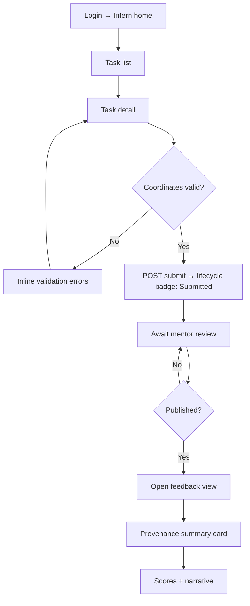
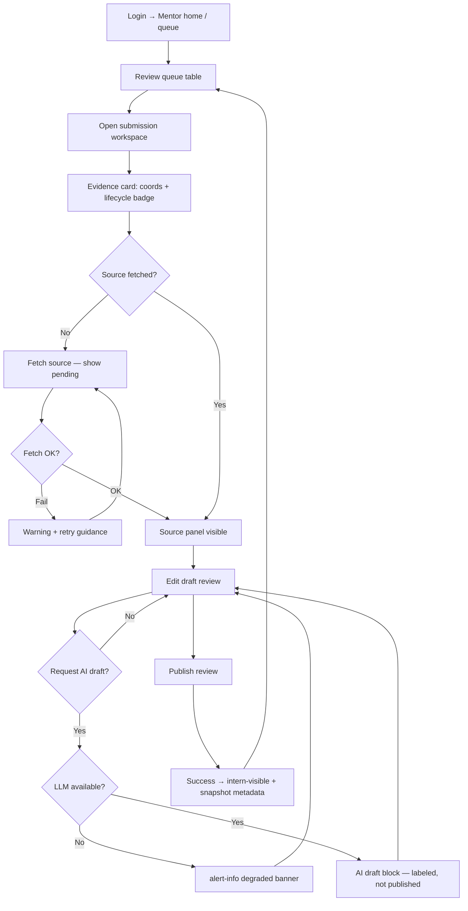
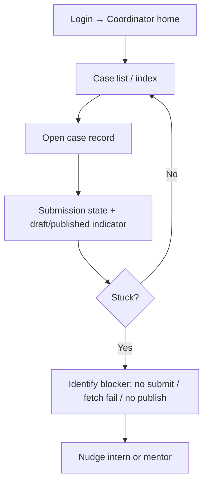

# UX Design Specification examinai_py

**Author:** Alex
**Date:** 2026-05-18

---

## Executive Summary

### Project Vision

Examinai unifies internship-style code examination: interns prove work via version-control coordinates; mentors review against fetched source, optionally use audited AI drafts, and publish structured feedback; coordinators and administrators support the program without fragmenting the workflow across email and ad hoc links. The UX must make provenance, publish gates, and degraded integrations feel intentional—not bolted on.

### Target Users

- **Interns** need a simple loop: see assignment → submit/fix coordinates → read published feedback tied to their submission.
- **Mentors** need a high-trust workspace: visible Git fetch state, draft review, optional AI assist with clear audit, and human-only publish when LLM is unavailable.
- **Coordinators** need read-oriented case visibility to spot stuck flows without mentor-level editing.
- **Administrators** need efficient user/role management before cohorts go live.
- **Operators** rely on health/smoke paths; their UX needs are minimal but error surfaces must not confuse end users.

### Key Design Challenges

- Consolidate mentor workspace states (fetch, source, draft, AI, publish, degradation) without overwhelming cognitive load.
- Communicate AI vs. human judgment and auditability to mentors and interns.
- Design explicit, recoverable failure paths for Git and Ollama integrations.
- Evolve UX within brownfield HTTP/template parity constraints.
- Maintain clear role-based navigation across five personas.

### Design Opportunities

- System-wide submission lifecycle storytelling (status, next steps, errors).
- Mentor review queue and workspace optimized for batch review.
- Degraded-LLM messaging that reinforces mentor agency.
- Coordinator case views tuned for triage at a glance.
- WCAG-aligned core flows on an MPA/Bootstrap foundation.

## Core User Experience

### Defining Experience

The product’s core loop is evidence-backed assessment: interns anchor work with version-control coordinates; mentors retrieve normalized source, iterate in draft, optionally request audited AI assistance, and publish official feedback. Success is measured by durable, trustworthy outcomes—not by feature count or URL parity alone.

The primary “hero” interaction is the **mentor publish moment**: it transforms private judgment (and optional AI draft) into the intern’s official record with snapshot metadata. The intern’s hero moment is **opening published feedback** and recognizing it applies to their submitted coordinates.

### Platform Strategy

- **Form:** Multi-page, server-rendered web application (FastAPI + Jinja2).
- **Interaction:** Mouse/keyboard first; laptop-width layouts primary; tablet/mobile readable for quick checks.
- **Browsers:** Latest Chrome, Firefox, Safari, Edge (current −1) for pilot.
- **Constraints:** CSRF on mutating requests; role-based URL spaces; Bootstrap 5 + jQuery parity with legacy UI where required.
- **Out of scope for MVP UX:** SPA routing, offline mode, native apps, public SEO.

### Effortless Interactions

- Intern coordinate submission with inline validation and lifecycle status (what’s wrong, what’s next).
- Mentor visibility into Git fetch progress and outcome without silent failure.
- One obvious publish action with human-only path when LLM is unavailable.
- Coordinator case view that surfaces submission/review state for triage without mentor tooling clutter.
- Post-login routing to role-appropriate home surfaces.

### Critical Success Moments

| Persona | Moment | Why it matters |
|---------|--------|----------------|
| Intern | First published feedback read | Proves the program “counts” their work |
| Mentor | Human-only publish while LLM degraded | Proves AI is optional, not a blocker |
| Mentor | AI draft received with clear draft vs. publish distinction | Proves trust and auditability |
| Coordinator | Case record identifies stuck flow | Proves oversight without taking the pen |
| Administrator | New cohort roles correct on first login | Proves program can scale operationally |

### Experience Principles

1. **Provenance first** — Show what evidence the review is based on.
2. **Publish is the gate** — Separate mentor iteration from intern-visible outcomes.
3. **Degradation is normal** — Design Git and LLM failure as first-class UX states.
4. **Role clarity** — Navigation and permissions match persona mental models.
5. **Explicit slow paths** — Fetch and AI are deliberate actions with visible outcomes.

## Desired Emotional Response

### Primary Emotional Goals

- **Interns** should feel **seen and fairly treated**: their submission is a durable record, and published feedback clearly belongs to their work.
- **Mentors** should feel **in control and professionally capable**: they author outcomes, AI assists only when useful, and degradation never removes agency.
- **Coordinators** should feel **oriented and effective**: they can triage program health without becoming reviewers.
- **Administrators** should feel **competent and ready**: cohort setup is boring in a good way—predictable and complete.

The emotional differentiator versus email-and-ZIP workflows is **trust through provenance**: users feel the system remembers what happened and why.

### Emotional Journey Mapping

| Stage | Intern | Mentor | Coordinator |
|-------|--------|--------|-------------|
| First login | Welcomed into *my* tasks | Welcomed into *my* review workload | Welcomed into *program visibility* |
| Core action (submit / review) | Focused—small form, clear validation | Calm focus—evidence and draft in one place | Quick scan—case state readable |
| Success (feedback / publish) | Accomplishment—“it counted” | Satisfaction—outcome shipped | Relief—flow is moving |
| Failure (Git / LLM / validation) | Guided recovery, not shame | Unblocked path, not blame | Clear signal for outreach |
| Return visit | Continuity—status remembered | Momentum—queue shows what’s next | Confidence—patterns are familiar |

### Micro-Emotions

| Priority | Target state | Avoid |
|----------|--------------|-------|
| High | **Trust** in published outcomes and AI audit | Skepticism about “black box” scoring |
| High | **Confidence** in submission and fetch state | Confusion about what happens next |
| High | **Control** for mentors over publish vs. draft | Anxiety when Ollama is down |
| Medium | **Accomplishment** for interns reading feedback | Frustration from opaque errors |
| Medium | **Calm efficiency** for batch mentor review | Overwhelm from cluttered workspace |

### Design Implications

- **Trust** → Show commit/scope/fetch version near feedback; label AI-generated draft content distinctly from published mentor judgment.
- **Confidence** → Submission lifecycle badge, inline validation, explicit Git fetch states (in progress / success / failed).
- **Control** → Degraded inference banner with human-only publish always visible; draft vs. published visually distinct.
- **Accomplishment** → Intern feedback page leads with “your submission” summary before scores/narrative.
- **Calm efficiency** → Review queue → workspace path; progressive disclosure for source text and AI panels.

### Emotional Design Principles

1. **Agency over automation** — AI suggests; humans publish.
2. **Transparency builds trust** — State and provenance are visible by default.
3. **Failure is instructional** — Errors explain the next action, not just the problem.
4. **Dignity in assessment** — Copy and tone avoid surveillance or punishment framing.
5. **Momentum for mentors** — Degraded paths feel like continuity, not emergency mode.

## UX Pattern Analysis & Inspiration

### Inspiring Products Analysis

**GitHub (pull request review)**  
Solves code review with immutable commit references, visible diff/source, inline discussion, and a clear “approved/merged” outcome. Examinai adapts this for internship programs: interns submit coordinates; mentors review fetched source; **publish** is the merge equivalent.

**Canvas / Google Classroom (assignment workflow)**  
Solves the student loop: see assignment → submit work → receive instructor feedback. Examinai mirrors this for interns with coordinate submission and published review consumption—without becoming a full LMS.

**Linear (work queue)**  
Solves “what should I work on next?” with status-forward lists. Examinai’s mentor **review queue** should borrow queue semantics: filterable list, status at a glance, one-click into workspace.

**Stripe-style operational status**  
Solves trust in async operations with explicit pending/success/failed states. Git fetch and LLM inference map directly: never silent; always recoverable next step.

### Transferable UX Patterns

**Navigation**
- Role-based home surfaces after login (Classroom: student vs. teacher views).
- Breadcrumb or page title that states persona context (“Intern · Task · Submit”).

**Interaction**
- **Status chips** for submission lifecycle (pending fetch, ready for review, published).
- **Primary action hierarchy**: one dominant CTA per screen (Submit / Fetch / Publish).
- **Progressive disclosure**: collapsed source panel until fetch succeeds; AI panel secondary to draft form.
- **Draft vs. published** visual system (PR draft comment vs. merged review).

**Visual**
- Bootstrap alert variants for degraded LLM (info, not error-red panic).
- Monospace blocks for SHAs, repo paths, and scope—scannable provenance.
- Summary card at top of intern feedback (“Your submission at publish time”).

### Anti-Patterns to Avoid

- **Black-box scoring** — numeric grade without evidence link (breaks trust).
- **Blocking publish on AI** — forces mentor helplessness when Ollama is down.
- **Email-thread UX** — feedback only in notifications, no durable in-app record.
- **Kitchen-sink mentor page** — fetch, source, rubric, AI, publish equally loud.
- **Silent integration failure** — spinner forever or generic 500 with no recovery.
- **Surveillance copy** — “AI evaluated you” without draft/publish distinction.

### Design Inspiration Strategy

**Adopt**
- GitHub-like provenance display (repo, commit, path scope, fetch version).
- Classroom-like intern task → submit → feedback loop.
- Linear-like mentor queue with status-first rows.
- Stripe-like explicit async operation states for Git and LLM.

**Adapt**
- PR diff → normalized source panel (read-only, mentor-facing; may be text not full diff UI in MVP).
- Copilot suggest → AI draft block clearly labeled, never auto-published.
- Full LMS gradebook → coordinator case record (read-only triage, not grade export).

**Avoid**
- SPA complexity and client-side routing (stay MPA per architecture).
- Auto-publish AI output.
- Feature parity with legacy UI that hides state or duplicates CTAs.

**Open input:** Stakeholders may add program-specific tools (e.g. internal portal, Gerrit) in a future revision of this section.

## Design System Foundation

### 1.1 Design System Choice

**Bootstrap 5.3** (via WebJars) as the component foundation, with **jQuery 3.7** and **jQuery UI 1.13** only where legacy welcome/UI parity requires them. Application-specific styling lives in **`examai-theme.css`** (and related static assets). Server-rendered **Jinja2** templates compose Bootstrap patterns; no SPA component framework in MVP.

### Rationale for Selection

- **Brownfield contract:** HTTP and static asset parity with the reference UI; Bootstrap is already the documented stack.
- **Delivery speed:** Tables, forms, alerts, badges, and nav patterns cover intern, mentor, admin, and coordinator flows without reinventing primitives.
- **Team fit:** Backend-focused implementation in FastAPI; design system stays CSS + template fragments, not npm-heavy UI kits.
- **Emotional goals:** Bootstrap alerts/cards support trust (provenance cards), control (degraded inference banner), and confidence (status badges) without custom illustration work.

### Implementation Approach

1. **Serve WebJar-equivalent static routes** for Bootstrap, jQuery, and jQuery UI per `docs/api-contracts.md`.
2. **Shared fragments** — extend `fragments/head-bootstrap.html`, lifecycle badge, degraded-inference banner, git-retrieval partials as the composition layer.
3. **Semantic extensions** — define reusable classes or Bootstrap utility combos for submission lifecycle, integration status, and draft-vs-published states.
4. **Page templates** mirror reference paths (`intern/tasks/`, `tasks/submission-detail.html`, etc.) with improved hierarchy where parity allows.
5. **Do not introduce** Tailwind, MUI, or a parallel CSS framework in MVP.

### Customization Strategy

- **Theme file:** Centralize color, spacing, and typography tokens in `examai-theme.css` (primary brand, success/warning/info for states, monospace for provenance).
- **Status vocabulary:** Map submission and integration states to consistent badge + alert variants (e.g. degraded LLM = `alert-info`, fetch failure = `alert-warning` with recovery CTA).
- **Density:** Laptop-first; use Bootstrap grid and `table-responsive` for lists; avoid custom breakpoints until coordinator mobile needs are validated.
- **Progressive enhancement:** jQuery UI limited to welcome/legacy surfaces; new mentor/intern flows prefer vanilla Bootstrap + minimal JS.
- **Future:** If brand guidelines arrive later, swap tokens in `examai-theme.css` without changing template structure.

## 2. Core User Experience

### 2.1 Defining Experience

**“Review the code at this commit and publish official feedback.”**

The signature interaction is the **mentor submission workspace** (`tasks/submission-detail` and related routes): mentor opens a submission, sees coordinates and fetch state, reads normalized source, works in a **draft review** (optionally requests an **AI draft**), and **publishes** — making outcomes visible to the intern with snapshot metadata.

If this flow is clear, trustworthy, and resilient when Git or Ollama fails, the product delivers its promise. Intern flows (submit coordinates → read published feedback) are essential but secondary in complexity; they succeed when the mentor gate works.

### 2.2 User Mental Model

| Persona | Mental model today | Expectation in Examinai |
|---------|-------------------|-------------------------|
| **Intern** | “I turn in homework” (email, ZIP, link) | “I point the system at my commit; when feedback is published, it’s about *that* work.” |
| **Mentor** | “I read code somewhere, write comments, send them” | “I open one case, see the fetched source, draft, optionally get AI help, then publish once.” |
| **Coordinator** | “I ask people in chat what’s stuck” | “I open a case and see state without doing the review.” |

**Confusion risks:** draft vs. published; AI draft vs. mentor judgment; fetch in progress vs. failed vs. never run; intern-visible vs. mentor-only state.

### 2.3 Success Criteria

- Mentor can complete **fetch → draft → publish** without leaving the workspace for a single submission.
- **Publish** is always available without a successful LLM run.
- Intern feedback page shows **provenance** (repo, commit, scope) adjacent to scores/narrative.
- Git/LLM failures show **status + next action** within 2 page loads (no dead ends).
- Coordinator case view answers “stuck where?” without mentor tools.

### 2.4 Novel UX Patterns

**Mostly established patterns, combined:**

- GitHub-like **commit-scoped review** (familiar to mentors).
- LMS-like **assignment feedback** (familiar to interns).
- **Novel combination:** optional **audited AI draft** that never auto-publishes, plus **degraded LLM** as a normal banner state—not a separate “error app.”

**Education needed:** Minimal for mentors who know PRs; interns need lifecycle badge + short copy on first submit (“feedback appears after mentor publishes”).

### 2.5 Experience Mechanics

**Mentor workspace (defining flow)**

| Phase | User action | System response |
|-------|-------------|-----------------|
| **Initiation** | Open submission from task list or review queue | Show coords, lifecycle badge, last fetch state |
| **Evidence** | Click **Fetch source** (if needed) | Pending → success (source panel) or failed (retry guidance) |
| **Draft** | Edit scores/narrative in draft form | Autosave or explicit save per contract; clear “draft, not published” |
| **AI (optional)** | Request AI draft | Loading state; on success, labeled block + audit link; on degrade, banner, draft unchanged |
| **Completion** | Click **Publish** | Confirm if policy requires; intern-visible outcome; snapshot metadata stored |
| **After** | Return to queue or next submission | Queue row status updates to published |

**Intern mirror (supporting flow)**

| Phase | Action | Response |
|-------|--------|----------|
| Initiation | Open assigned task | Task detail + submit form |
| Interaction | Enter repo, SHA, path scope | Inline validation |
| Feedback | Lifecycle badge updates | “Awaiting review” → “Published” |
| Completion | Open feedback view | Summary card + published review content |

## Visual Design Foundation

### Color System

**Base:** Bootstrap 5 default palette with overrides in `examai-theme.css`. Visual tone is **professional, calm, trustworthy** (assessment tool, not consumer social).

**Semantic mapping**

| Role | Use | Bootstrap / token |
|------|-----|-------------------|
| **Primary** | Main CTAs (Submit, Fetch, Publish) | `--examai-brand` → Bootstrap `primary` |
| **Success** | Fetch succeeded, published, healthy | `success` |
| **Warning** | Retryable Git failure, validation hints | `warning` |
| **Info** | Degraded LLM, informational banners | `info` (not error-red) |
| **Danger** | Auth errors, destructive admin actions | `danger` |
| **Secondary** | Secondary actions, metadata labels | `secondary` |
| **Muted** | Hints, timestamps, helper text | `text-muted` |
| **Provenance** | Repo, SHA, path scope | Monospace on `bg-light` card |

**Lifecycle badges (submission)**

- Draft / awaiting review → `secondary` or `warning`
- Ready for mentor / fetch OK → `primary` or `info`
- Published → `success`
- Fetch failed → `warning` + recovery link

**Draft vs. published**

- Draft review panel → light border, “Draft” badge (`secondary`)
- Published feedback (intern) → `success` accent on summary card header only—not full green page

**Contrast:** Meet WCAG AA for body text and primary buttons on default Bootstrap backgrounds; verify provenance monospace blocks on `bg-light`.

### Typography System

**Tone:** Professional and readable; no display fonts.

| Element | Approach |
|---------|----------|
| **Headings** | Bootstrap defaults (`h1`–`h6`); page title + persona context |
| **Body** | System stack via Bootstrap; 16px base for forms and feedback narrative |
| **Provenance** | `font-family: var(--bs-font-monospace)` for SHA, repo URL, path scope |
| **Source code panel** | Monospace, `small`, scrollable `pre` or `code` block |
| **Labels** | `form-label` + `text-muted` helpers |

**Hierarchy rules**

1. Page title → provenance summary card → primary CTA → form content → secondary panels (AI, source).
2. Intern feedback: “Your submission” summary before scores/narrative.
3. Max line length ~70ch for long narrative feedback where possible.

### Spacing & Layout Foundation

**Density:** Efficient but not cramped — laptop-first mentor workspace.

**Spacing unit:** Bootstrap 4px / 0.25rem scale. Prefer `mb-3`, `mb-4` between major sections.

**Grid**

- Lists: full-width container, `table` or card list
- Workspace: two-column on `lg+` — coords/status left; draft/publish right
- Cards for provenance, AI draft, degraded banner (full width above columns)

**Layout principles**

1. One primary CTA per viewport.
2. Status above the fold on typical laptop heights.
3. Progressive disclosure for source panel until fetch succeeds.

### Accessibility Considerations

- Target **WCAG 2.x AA** on login, task list, coordinate submit, mentor publish, intern feedback.
- Visible focus rings; form errors with `invalid-feedback`.
- Badges include text labels; color is not the only signal.
- Touch targets ≥ 44px where mobile coordinator use is validated later.

## Design Direction Decision

### Design Directions Explored

Four directions documented in `ux-design-directions.html`:

1. **Bootstrap default** — flat, minimal chrome
2. **Structured workspace** — evidence card, two-column mentor layout, degraded LLM banner
3. **Dense table-first** — status-forward review queue
4. **Calm academic** — spacious intern feedback with provenance summary card

### Chosen Direction

**Primary: Direction 2 (Structured workspace)** for mentor submission detail and review flows.  
**Secondary: Direction 3 (Dense table-first)** for `review/queue.html` and task submission lists.  
**Intern feedback:** Adopt Direction 4’s provenance summary card pattern within Direction 2’s Bootstrap primary palette (no separate green brand in MVP).

### Design Rationale

- Aligns with core experience (mentor workspace as defining interaction).
- Supports emotional goals: trust (evidence card), control (draft badge + publish CTA), calm degradation (`alert-info`).
- Implements visual foundation tokens without a full rebrand.
- Brownfield-feasible in Jinja2 + Bootstrap 5 + `examai-theme.css`.

### Implementation Approach

- Refactor `tasks/submission-detail.html` (and Python equivalent) to: full-width status/banner → evidence card → `row` with source (col-lg-5) + draft form (col-lg-7).
- Style review queue as compact `table-sm` with status badges (Direction 3).
- Intern `feedback.html`: provenance summary card header before scores (Direction 4 spacing).
- Extend `examai-theme.css` with card border utilities for evidence panel and draft panel.

## User Journey Flows

### Intern — Submit coordinates and read feedback

Maya’s happy path: assigned task → valid coordinates → await review → published feedback.

**Entry:** `/intern/tasks` → task detail.  
**Success:** Feedback page shows commit/scope at publish time.  
**Recovery:** Fix SHA/repo/scope; badge explains state.  
**UI (Direction 4):** Provenance card before scores.

### Mentor — Review workspace (defining flow)

Diego’s path including degraded LLM: queue → workspace → fetch → draft → optional AI → publish.

**Entry:** `/review/queue` or task submissions list.  
**Success:** Publish without LLM when degraded.  
**UI (Direction 2):** Banner → evidence card → two-column source + draft.

### Coordinator — Case triage

Priya’s oversight path: find stuck case → nudge out of band (no publish).

**Entry:** `/coordinator/**` case routes.  
**Success:** Blocker visible in one screen.  
**UI:** Read-only; no mentor draft controls.

### Journey Patterns

| Pattern | Use |
|---------|-----|
| **Status-first navigation** | Queue/table rows show lifecycle badge before open |
| **Evidence card** | Repo + SHA + scope + fetch status grouped |
| **Single primary CTA** | Submit / Fetch / Publish per screen |
| **Degraded integration banner** | `alert-info` for LLM; `alert-warning` for Git retry |
| **Provenance before content** | Intern feedback and mentor evidence top-of-page |
| **POST + redirect** | MPA form posts with CSRF; full page state refresh |

### Flow Optimization Principles

1. **Minimize steps to publish** — Queue → workspace → fetch (if needed) → publish in one session.
2. **Never block publish on AI** — Degraded path stays on same screen.
3. **Explain state in place** — Badges and banners, not separate error pages.
4. **Reuse fragments** — `submission-lifecycle-badge`, `degraded-inference-banner`, `git-retrieval`.
5. **Confirm destructive actions only** — Publish confirm if policy requires; not for fetch/AI request.

## Component Strategy

### Design System Components

**From Bootstrap 5 (WebJars):** `navbar`, `card`, `alert`, `badge`, `table`, `form-*`, `btn`, `modal` (confirm publish), `breadcrumb` (optional), utilities (`mb-*`, `row`, `col-*`).

**Existing app fragments** (extend, do not replace):

| Fragment | Path | Role |
|----------|------|------|
| Head / shell | `fragments/head-bootstrap.html` | CSS/JS includes |
| Git retrieval | `tasks/fragments/git-retrieval.html` | Fetch trigger + status |
| Degraded LLM | `tasks/fragments/degraded-inference-banner.html` | `alert-info` banner |
| Lifecycle badge | `intern/fragments/submission-lifecycle-badge.html` | Intern/mentor status |

### Custom Components

#### Evidence card (mentor + intern read views)

**Purpose:** Group provenance (repo, commit, path scope, fetch version) in one scannable unit.  
**Anatomy:** Card header “Evidence” · monospace body · status badge · optional fetch CTA.  
**States:** not fetched · pending · success · failed.  
**Accessibility:** `aria-live="polite"` on status region after fetch POST.

#### Submission lifecycle badge

**Purpose:** Single label for submission phase across list, detail, queue.  
**States:** not submitted · submitted · fetch failed · ready for review · draft · published.  
**Variants:** `badge-sm` in tables; default on detail pages.

#### Mentor draft review panel

**Purpose:** Scores + narrative with explicit draft semantics.  
**States:** empty draft · saved draft · AI draft appended (labeled).  
**Actions:** Save draft (POST), Request AI draft, Publish (primary).

#### AI draft block

**Purpose:** Show model-generated suggestion separate from publish.  
**Anatomy:** `alert-secondary` or bordered panel · “AI draft — not published” · link to audit metadata.  
**States:** unavailable (hidden) · loading · success · error (inline, non-blocking).

#### Source preview panel

**Purpose:** Read-only normalized source after successful fetch.  
**States:** collapsed (pre-fetch) · expanded · empty/error.  
**Accessibility:** Scrollable `pre` with `tabindex="0"` for keyboard scroll.

#### Provenance summary card (intern feedback)

**Purpose:** “Your submission at publish time” before scores (Direction 4).  
**Content:** commit, scope, fetch version from snapshot metadata.

#### Review queue row

**Purpose:** Dense status-first entry (Direction 3).  
**Anatomy:** `table-sm` row · intern · task · lifecycle badge · Open link.

### Component Implementation Strategy

- Implement as **Jinja2 macros/includes** under `src/examai/templates/`, mirroring reference paths in `docs/component-inventory.md`.
- Pass **view models** from FastAPI (fetch state, lifecycle enum, degraded flag)—no business logic in templates.
- Style via **`examai-theme.css`** semantic classes (e.g. `.examai-evidence-card`, `.examai-draft-panel`).
- One **primary CTA** per template via fragment parameters where needed.

### Implementation Roadmap

**Phase 1 — Core (mentor defining flow)**  
Evidence card · git-retrieval fragment (enhanced) · draft review panel · degraded banner · lifecycle badge

**Phase 2 — Intern + queue**  
Provenance summary card · review queue table styling · intern task detail submit form validation UX

**Phase 3 — Coordinator + polish**  
Case record read-only status strip · publish confirm modal · accessibility pass on Phase 1–2 flows

## UX Consistency Patterns

### Button Hierarchy

| Level | Style | Use | Examples |
|-------|-------|-----|----------|
| **Primary** | `btn btn-primary` | One per screen — main forward action | Submit coordinates, Fetch source, Publish review |
| **Secondary** | `btn btn-outline-secondary` | Supporting actions | Save draft, Request AI draft, Back to queue |
| **Tertiary** | `btn btn-link` | Low emphasis navigation | Cancel, View task |
| **Destructive** | `btn btn-danger` | Irreversible admin actions | Delete user (admin only) |

**Rules:** Never two primary buttons in the same viewport. Publish is always primary on mentor workspace; Fetch is primary only when source not yet retrieved.

### Feedback Patterns

| Type | Bootstrap | When | Copy tone |
|------|-----------|------|-----------|
| **Success** | `alert-success` | Publish succeeded, submit accepted | Brief, factual |
| **Warning** | `alert-warning` | Git fetch failed, validation | What failed + what to do next |
| **Info** | `alert-info` | LLM degraded, awaiting review | Calm, agency-preserving |
| **Danger** | `alert-danger` | Auth failure, permission denied | Direct, no blame |
| **Inline** | `invalid-feedback` | Form field errors | Field-specific |

**Rules:** Integration failures stay on the working page (banner), not a separate error route. LLM degradation always uses **info**, not danger.

### Form Patterns

- **Labels:** Every input has visible `form-label`; helpers use `form-text text-muted`.
- **Validation:** Server-side; re-render with `is-invalid` + `invalid-feedback` (MPA).
- **CSRF:** Hidden token on every mutating POST.
- **Provenance fields:** Repo URL, commit SHA, path scope — monospace inputs or stacked fields with examples in helper text.
- **Draft review:** Textarea for narrative; numeric or select for rubric fields per data model.
- **Grouping:** Related fields in `card` or `fieldset`; provenance separate from review content.

### Navigation Patterns

- **Post-login:** Redirect to role home (`/intern/**`, `/tasks/**`, `/coordinator/**`, `/admin/**`).
- **Navbar:** Role label + sign-out; links only to permitted URL spaces.
- **Task flow:** List → detail → action → redirect back with flash/status on page (no toast library in MVP).
- **Mentor:** Queue ↔ workspace via table link; breadcrumb optional (`Task · Submission`).
- **Coordinator:** Index → case record (read-only).

### Additional Patterns

**Loading / pending**  
Full page reload after POST for fetch/AI; show badge “In progress…” or disabled button during submit. No infinite spinners without status text.

**Empty states**  
Intern task list empty: “No assignments yet.” Review queue empty: “No submissions awaiting review.” Include who to contact (coordinator/admin).

**Modals**  
Use Bootstrap modal only for publish confirmation (if required) and destructive admin confirms—not for fetch or AI.

**Tables**  
`table-sm table-hover` for queues; lifecycle badge in Status column; primary action in rightmost column.

**Empty / missing source**  
Source panel shows instructional empty state: “Fetch source to preview code here.”

## Responsive Design & Accessibility

### Responsive Strategy

| Device | Priority | Layout approach |
|--------|----------|-----------------|
| **Desktop / laptop (1024px+)** | Primary | Two-column mentor workspace; full tables; source panel beside draft |
| **Tablet (768–1023px)** | Secondary | Stack workspace columns; `table-responsive` horizontal scroll for queues |
| **Mobile (<768px)** | Tertiary | Single column; coordinator/intern quick-check only—not primary mentor review |

**Desktop:** Use width for evidence card + side-by-side source/draft (Direction 2).  
**Tablet:** Collapse to single column; keep status badge and primary CTA above fold.  
**Mobile:** Intern submit/feedback and coordinator case view usable; mentor deep review acceptable but not optimized in MVP.

### Breakpoint Strategy

Use **Bootstrap 5 defaults** (no custom breakpoints in MVP):

- `sm` 576px · `md` 768px · `lg` 992px · `xl` 1200px

**Rules**

- Mentor workspace: `col-lg-5` / `col-lg-7` → full width below `lg`.
- Review queue: always `table-responsive` wrapper below `md`.
- Navbar: Bootstrap collapse for narrow widths if nav links added later.

**Approach:** Desktop-first templates (matches mentor primary use), with Bootstrap grid ensuring graceful stack on smaller viewports.

### Accessibility Strategy

**Target:** **WCAG 2.1 Level AA** on core flows: login, intern task/submit, mentor workspace (fetch, draft, publish), intern feedback, coordinator case view.

**Requirements**

- **Contrast:** Bootstrap defaults + verify `examai-theme.css` overrides meet 4.5:1 body text.
- **Keyboard:** All form controls and primary actions reachable; logical tab order (status → evidence → draft → publish).
- **Focus:** Visible `:focus-visible` on buttons and inputs (Bootstrap default; do not remove).
- **Labels:** Associated `<label for>` on all inputs; `aria-describedby` for helper/error text.
- **Live regions:** `aria-live="polite"` on Git fetch status and post-publish flash areas.
- **Badges/alerts:** Text labels always present (not color-only).
- **Source panel:** Scrollable `pre`/`code` keyboard-accessible.
- **Skip link (Phase 3):** “Skip to main content” on authenticated shell.

**Not in MVP:** Full AAA audit, automated a11y CI gate (manual pass per delivery strategy).

### Testing Strategy

**Responsive (manual)**

- Chrome, Firefox, Safari, Edge at 1280px, 768px, 375px widths.
- Mentor workspace stack at `lg` breakpoint; queue table scroll on narrow screens.

**Accessibility (manual)**

- Keyboard-only pass on login, submit, publish paths.
- VoiceOver (macOS) or NVDA (Windows) on intern feedback + mentor workspace.
- axe DevTools or WAVE on five core templates (document findings in story/QA notes).

**User testing:** Include at least one keyboard-only or screen-reader check before pilot if program requires procurement a11y evidence.

### Implementation Guidelines

**Responsive**

- Prefer Bootstrap grid/utilities over custom `@media` unless `examai-theme.css` needs one-off fixes.
- Use `table-responsive`, `overflow-auto` on source `pre`, not fixed viewport heights that clip content.
- Touch targets: `btn` default padding sufficient; avoid `btn-sm` as sole CTA on mobile-critical paths.

**Accessibility**

- Semantic HTML: `main`, `nav`, `form`, `button` — not styled `div`s as controls.
- Do not rely on color alone for submission lifecycle or fetch state.
- Publish confirm modal: trap focus, `aria-modal="true"`, return focus to trigger on close.
- Error messages in `invalid-feedback` linked via `aria-describedby`.
